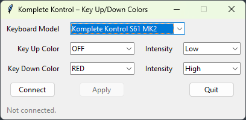

# Kontrol Color Controller

A Tkinter GUI tool to set **Key Up** and **Key Down** LED colors on Native Instruments **Komplete Kontrol** keyboards.

Most importantly it can set the color to OFF. A feature the software Native Instruments provides, lacks. 

It communicates directly with the keyboard over **USB HID** (not MIDI).

HID report id was found via wireshark while using Native Instruments software to change color. 

Currently **ONLY** works with **MK2** variant keyboards.





## Features

- Select your keyboard **model** (S25/S49/S61/S88, MK1 or MK2).
- For **MK2** models:
  - Sends HID **0xA4** report where:
    - `buffer[5]` = **Key Up** color code
    - `buffer[6]` = **Key Down** color code
  - Color code = **base code** + **intensity offset**.
- Apply changes from the GUI.
- MK1 models display a warning (different LED protocol — not applied by this version).

---

## Requirements

- Windows
- Python 3.10+ 

## How to Run

```cmd
python3 -m pip install -r requirements.txt
python3 gui.py
```

